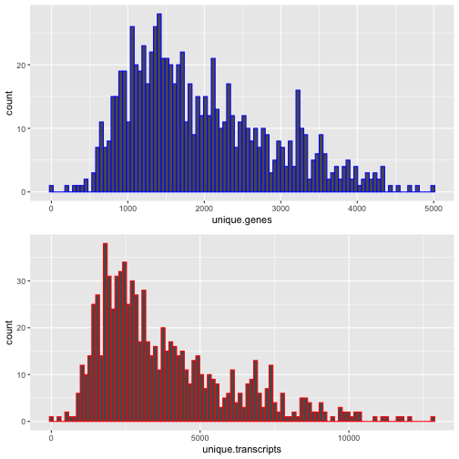

ST Quality Control
========================================================
author: Eva, Linnea and Zaneta
date: 190620
autosize: true


Spatial Transcriptomics Data
========================================================

- RNA-seq based method 
- No individual cells -> spots with probes under tissue 
  - 1 spot ~ 30 cells
  - + Spatial info (coordinates)


ST DATA
========================================================

Sequencing -> QFilter, Mapping and Annotation -> .tsv files

 - rownames:Ensembl gene names
 - colnames:Spot coordinates

 
Spots_under_tissueselection matrix -> .tsv file spot coordinates of spots under tissue

First part of ST.QC
========================================================


```
                  10x11 10x12 10x13 10x14
ENSG00000279457.3     1     0     0     0
ENSG00000225972.1     0     0     0     1
ENSG00000225630.1     0     0     0     0
ENSG00000237973.1     0     0     0     0
```

```
    x y new_x new_y pixel_x pixel_y
1x5 1 5  0.97  5.06   122.4   689.8
1x6 1 6  0.97  6.05   123.2   833.8
1x7 1 7  1.03  7.09   131.4   985.2
1x8 1 8  1.02  8.07   130.6  1127.5
```


Filtering and Subsetting the Data
========================================================


```
Number of genes in raw dataset:  28133 
Number of genes in subset dataset:  25836 
Number of spots in raw dataset:  990 
Number of spots in subset dataset:  833 
```

Converting gene ids and sorting
========================================================


```
              10x11 10x12 10x13 10x14 10x16
FO538757.1        1     0     0     0     0
MTND1P23          0     0     0     1     0
MTND2P28          0     0     0     0     0
MTCO1P12          0     0     0     0     0
MTCO2P12          0     0     0     0     0
MTATP8P1          0     1     0     0     0
MTATP6P1          2     4     0     0     0
MTCO3P12          0     0     0     0     0
RP11-206L10.8     0     0     0     0     0
LINC00115         0     0     0     0     0
LINC01128         0     0     0     0     0
RP11-54O7.1       0     0     0     0     0
RP11-54O7.3       0     0     0     0     0
SAMD11            0     0     0     0     0
NOC2L             0     0     0     0     0
```

Histo_Unique Function
========================================================



Final Thoughts
==========================================================


